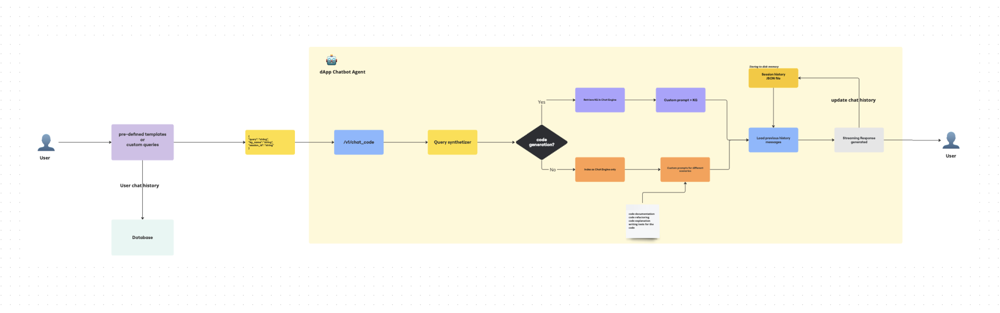

# dApp Code Generation

This repository demonstrates a code generation app powered by Large Language Models (LLMs) and Knowledge Graphs, specifically designed for Rust and Substrate framework development. The system uses Retrieval Augmented Generation (RAG) with specialized knowledge graphs to provide accurate and contextual code suggestions.

## System Overview

### Architecture Diagrams

The following diagrams illustrate the system architecture and components:


*Figure 1: Chatbot Agent Architecture - Shows the interaction flow between user interface, API layer, and knowledge graph components*


*Figure 2: AWS Infrastructure Diagram - Illustrates the cloud deployment architecture with AWS services and Memgraph integration*

### Core Concepts

The system combines several powerful concepts to provide accurate code generation:

1. **Knowledge Graphs (KG)**:
   - Structured representation of programming knowledge
   - Captures relationships between code concepts
   - Enables semantic understanding of code context
   - Built from curated documentation and repositories

2. **Retrieval Augmented Generation (RAG)**:
   - Uses knowledge graphs for context-aware code generation
   - Improves accuracy by providing relevant context to LLMs
   - Reduces hallucination in generated code
   - Enables domain-specific knowledge integration

3. **Multi-Framework Support**:
   - Specialized knowledge graphs for different frameworks
   - Independent processing of each framework's context
   - Extensible to new programming frameworks

### Architecture Design

The system is designed to be cloud-agnostic and easily deployable anywhere:

1. **Storage Layer**:
   - **S3 Object Storage**: For knowledge graph data persistence and backup
   - **Memgraph Database**: High-performance graph database for real-time knowledge graph operations
   - Can be adapted to any object storage (GCS, Azure Blob, MinIO)
   - Knowledge graphs are portable and framework-independent
   - Hybrid storage approach: S3 for persistence, Memgraph for active querying

2. **Knowledge Graph Database Layer**:
   - **Memgraph**: Primary graph database for knowledge graph operations
   - Vector search capabilities with embedding-based retrieval
   - Cypher query language support for complex graph traversals
   - Separate instances per framework (Substrate, Ink!, Solidity, Rust)
   - Real-time graph analytics and relationship discovery

3. **Compute Layer**:
   - Stateless API design
   - No cloud-specific compute requirements
   - Can run on any infrastructure (cloud, on-premise, local)
   - Horizontally scalable
   - Framework-specific query engines with Memgraph integration

4. **Caching Layer**:
   - Redis for performance optimization
   - Replaceable with any caching solution
   - Optional component for smaller deployments
   - Complements Memgraph's native performance optimizations

5. **Monitoring Layer**:
   - Langfuse for observability
   - Modular design allows different monitoring solutions
   - Optional for basic deployments

## Features

- AI-powered code generation for Rust and Substrate
- **Memgraph-powered Knowledge Graph Database**: High-performance graph database for real-time knowledge retrieval
- Knowledge Graph-enhanced context understanding with vector search capabilities
- RAG (Retrieval Augmented Generation) system with hybrid retrieval (vector + graph traversal)
- Multiple specialized knowledge bases (Substrate, Ink!, Solidity, Rust) with dedicated Memgraph instances
- Advanced Cypher query support for complex relationship discovery
- OpenZeppelin integration for Solidity smart contract patterns
- Observability and performance tracking with Langfuse
- Redis caching for improved response times
- Hybrid storage architecture (S3 + Memgraph) for optimal performance and persistence

## Project Structure
```
dApp-codegen/
├── api/
│   ├── app.py
│   └── utils.py
├── caching/
│   ├── __init__.py
│   └── redis_cache.py
├── demos/
│   ├── gradio/
│   │   ├── app_v2.py
│   │   └── app.py
│   └── streamlit/
├── knowledge_graph_core/
│   ├── data_ingestion/
│   ├── kg_construction/
│   │   ├── kg_creation.py
│   │   ├── kg_utils.py
│   │   └── visualization.py
│   ├── kg_rag/
│   │   ├── inference.py
│   │   ├── kg_config.py
│   │   └── kg_operations.py
│   └── prompts/
├── utils/
├── .env.example
├── requirements.txt
└── README.md
```

- **Knowledge Graph Core**: Manages document ingestion, graph construction, and RAG operations
- **API Layer**: FastAPI-based endpoints for code generation
- **Demo Interfaces**: Gradio and Streamlit UIs for easy interaction
- **Caching Layer**: Redis-based caching for performance optimization

## Deployment Flexibility

The system can be deployed in various ways:

1. **Cloud Providers**:
   - AWS (current setup with S3 + Memgraph Cloud)
   - Google Cloud (using GCS for storage + Memgraph instances)
   - Azure (using Blob Storage + Memgraph deployment)
   - Any cloud with object storage and container orchestration

2. **On-Premise**:
   - Private cloud infrastructure with Memgraph deployment
   - Local data centers with dedicated Memgraph instances
   - MinIO for S3-compatible storage + self-hosted Memgraph
   - Kubernetes clusters with Memgraph operators

3. **Local Development**:
   - Personal development machines with Docker Compose
   - CI/CD environments with containerized Memgraph
   - Testing environments with lightweight Memgraph instances
   - Development setup with local Memgraph containers

## Prerequisites

- Python 3.8+
- pip package manager
- **Memgraph Database**: Required for knowledge graph operations
  - Memgraph Cloud account (recommended) or self-hosted Memgraph instances
  - Separate instances for each framework (substrate, ink, solidity, rust)
  - Bolt protocol support (port 7687)
- Redis (optional, for caching)
- Git (for repository access)
- AWS credentials (for S3 access to knowledge graph data)

## Installation and Setup

The system uses pre-built knowledge graphs stored in S3. Here's how to set it up:

1. Clone the repository:
   ```bash
   git clone https://github.com/neurons-lab/dApp-codegen.git
   cd dApp-codegen
   ```

2. Create and activate a virtual environment:
   ```bash
   python -m venv venv
   source venv/bin/activate  # On Windows, use `venv\Scripts\activate`
   ```

3. Install the required dependencies:
   ```bash
   pip install -r requirements.txt
   ```

4. Set up the environment variables:
   ```bash
   cp .env.example .env
   ```
   Edit the `.env` file with your configuration:
   ```
   # Required - for accessing knowledge graphs
   AWS_ACCESS_KEY_ID=your_aws_access_key
   AWS_SECRET_ACCESS_KEY=your_aws_secret_key
   AWS_DEFAULT_REGION=your_aws_region
   
   # Memgraph Database Configuration (Required for KG operations)
   MEMGRAPH_USER=your_memgraph_username
   MEMGRAPH_PASSWORD=your_memgraph_password
   MEMGRAPH_PORT=7687
   MEMGRAPH_SOLIDITY_HOST=your_solidity_memgraph_host
   MEMGRAPH_INK_HOST=your_ink_memgraph_host
   MEMGRAPH_SUBSTRATE_HOST=your_substrate_memgraph_host
   MEMGRAPH_RUST_HOST=your_rust_memgraph_host
   
   # Optional
   REDIS_URL=your_redis_url  # For caching
   LANGFUSE_PUBLIC_KEY=your_langfuse_key  # For observability
   LANGFUSE_SECRET_KEY=your_langfuse_secret
   ```

The knowledge graphs are stored in S3 for persistence and loaded into Memgraph databases for high-performance querying. The system automatically manages the synchronization between S3 storage and Memgraph instances.

## Memgraph Setup

### Quick Start with Memgraph Cloud

1. **Create Memgraph Cloud Account**: Sign up at [memgraph.com](https://memgraph.com)
2. **Create Instances**: Set up separate instances for each framework:
   - `substrate-kg` - for Substrate framework knowledge
   - `ink-kg` - for Ink! smart contracts
   - `solidity-kg` - for Solidity development
   - `rust-kg` - for Rust programming patterns
3. **Configure Access**: Note the connection URLs and credentials for each instance
4. **Update Environment**: Add the connection details to your `.env` file

### Self-Hosted Memgraph (Docker)

For local development or on-premise deployment:

```bash
# Start Memgraph instances for each framework
docker run -d --name memgraph-substrate -p 7687:7687 memgraph/memgraph
docker run -d --name memgraph-ink -p 7688:7687 memgraph/memgraph  
docker run -d --name memgraph-solidity -p 7689:7687 memgraph/memgraph
docker run -d --name memgraph-rust -p 7690:7687 memgraph/memgraph
```

Update your environment variables accordingly:
```
MEMGRAPH_SUBSTRATE_HOST=localhost:7687
MEMGRAPH_INK_HOST=localhost:7688
MEMGRAPH_SOLIDITY_HOST=localhost:7689
MEMGRAPH_RUST_HOST=localhost:7690
```

## Knowledge Graph System

### Hybrid Architecture: S3 + Memgraph

The system uses a hybrid approach for knowledge graph management:

1. **S3 Storage**: Persistent storage for knowledge graph data, backups, and version control
2. **Memgraph Database**: High-performance graph database for real-time querying and vector search
3. **Automatic Synchronization**: Knowledge graphs are loaded from S3 into Memgraph instances on startup

### Available Knowledge Graphs

The following pre-built knowledge graphs are available, each running on dedicated Memgraph instances:

- **`substrate`**: Substrate framework knowledge graph
  - Core concepts and patterns
  - Common implementations
  - Best practices and examples
  - Dedicated Memgraph instance for optimal performance

- **`ink`**: Ink! smart contract knowledge graph
  - Contract patterns
  - Ink! specific features
  - Integration examples
  - Vector search for code pattern matching

- **`solidity`**: Solidity smart contract knowledge graph
  - Smart contract patterns
  - Security considerations
  - Common implementations
  - OpenZeppelin library integration
  - Enhanced with security vulnerability patterns

- **`rust`**: Rust programming language knowledge graph
  - Language features
  - Common patterns
  - Standard library usage
  - Performance optimization patterns

### Memgraph Integration Features

- **Vector Search**: Embedding-based similarity search for code patterns
- **Cypher Queries**: Complex graph traversals using Cypher query language
- **Real-time Analytics**: Live relationship discovery and pattern matching
- **Hybrid Retrieval**: Combines vector similarity with graph structure for enhanced context
- **Framework Isolation**: Separate Memgraph instances prevent cross-contamination between frameworks
- **Performance Optimization**: In-memory graph processing for sub-second response times

The knowledge graphs are designed to be:

- **Portable**: Can be moved between different storage systems (S3 ↔ Memgraph)
- **Versioned**: Support for different versions of frameworks with rollback capabilities
- **Extensible**: Can be enhanced with additional knowledge through both S3 and direct Memgraph updates
- **Efficient**: Optimized for quick retrieval with Memgraph's native performance
- **Scalable**: Horizontal scaling through multiple Memgraph instances

### Knowledge Graph Format

The knowledge graphs use a standardized format that:
- Captures code relationships and context
- Stores semantic information
- Enables efficient querying
- Supports incremental updates

This format makes it easy to:
- Move between different storage systems
- Back up and restore knowledge
- Share between different deployments
- Extend with custom knowledge

## Usage

### Running the API

To start the FastAPI endpoint:

```bash
cd api
uvicorn app:app --host 0.0.0.0 --port 8081
```

### Running the Demos

#### Gradio Demo App:
Navigate to the `demos/gradio` directory and run:
```bash
python app_v2.py
```

#### Streamlit Demo App:
Navigate to the `demos/streamlit` directory and run:
```bash
streamlit run app.py
```

## Example Inference Script

Here's a refactored example script to test the inference:

```python
import requests
from requests.auth import HTTPBasicAuth
import json
import time

def test_inference(api_url, prefix_code, username, password):
    payload = {
        "prefix_code": prefix_code,
        "kg_name": "substrate", # Available: substrate, ink, solidity, rust (each with dedicated Memgraph instance)
    }

    start_time = time.time()

    try:
        with requests.post(api_url, json=payload, auth=HTTPBasicAuth(username, password), stream=True) as response:
            if response.status_code == 200:
                full_response = ""
                for chunk in response.iter_content(chunk_size=512):
                    if chunk:
                        decoded_chunk = chunk.decode('utf-8')
                        full_response += decoded_chunk
                        print(decoded_chunk, end='', flush=True)
                
                end_time = time.time()
                elapsed_time = end_time - start_time
                print(f"\n\nElapsed time: {elapsed_time:.2f} seconds")
                return full_response
            else:
                print(f"Request failed with status code {response.status_code}")
                print(response.text)
                return None
    except requests.RequestException as e:
        print(f"An error occurred: {e}")
        return None

if __name__ == "__main__":
    API_URL = "http://localhost:8081/v1/generate_code"  # Update with your API URL
    USERNAME = "dapp-user"
    PASSWORD = ""  # Replace with actual password
    
    prefix_code = """///Common Generic traits Definition for pallets \n   pub type AccountOf<T>"""
    
    result = test_inference(API_URL, prefix_code, USERNAME, PASSWORD)
    if result:
        print("\nFull response:")
        print(result)
```

Save this script as `test_inference.py` in your project root and run it with:

```bash
python test_inference.py
```
